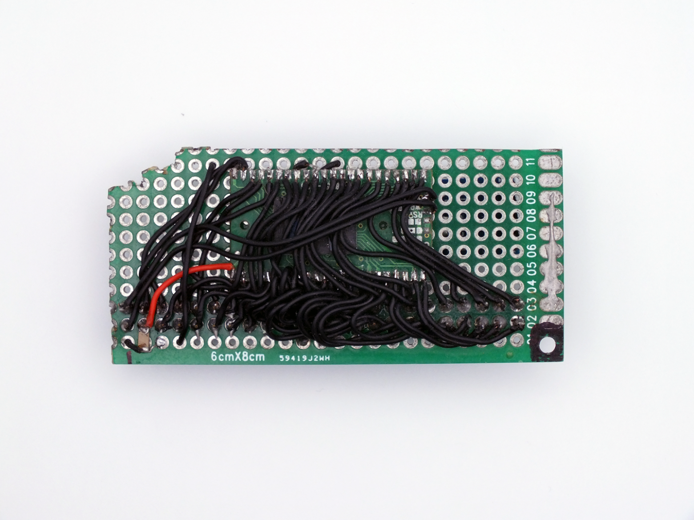

# The art of cutting and sewing or the ability to replace games in a portable SUP game console

>Note: the original article can be found [here](https://habr.com/ru/articles/718366/). All credits goes to [promolife](https://habr.com/ru/users/promolife/). I just took his work and translated it from russian to english.

Hello everyone, my name is Alexander. I enjoy programming and electronics development in my free time. I would like to tell you, comrades, the story of one programmer.

It was an ordinary January evening and there were no signs of trouble, but my friend’s son could not come to terms with idle family leisure time and broke the creation of the Chinese clone industry that he had just bought. Well, I broke it, dropped it, so to speak, from the 8th floor. Having collected the remains of the miracle of the Asian uncle, a friend with hope in his eyes handed me the remains of the victim.

As you probably already guessed, we will talk about the portable SUP console, which is a clone of the regular Famicom in portable form, and made in the GameBoy form factor. Looking ahead, I will say that it was not possible to repair the poor fellow, but she still had one intact element left - a flash memory chip. Here I, as a kid who loved to play Dendy in the dashing 90s, got old school and, having wandered on one well-known classifieds site, purchased a similar console for study. There are plenty of reviews on the Internet about it, so I’ll briefly tell you what the console is. 3.5-inch color TN display, a single-sided board with an SoC drop, a flash memory chip on an adapter board, a little loose stuff, a simple battery from old Nokia phones, a cheap plastic case and an additional joystick. The console can also output image and sound to a TV via a composite video signal and had as many as 400 games on board. Well, not the worst set.

The set, technically, may not be bad. But there's a problem with games. As is often the case with Chinese multi-game games, many of the games were hacks of one game, such as Super Mario or Contra, as well as a collection of strange games that I personally did not know about until this moment. Perhaps another craft from masters of assembly kung fu, although I even found one game in Russian. We began searching the forums for opportunities to diversify the Asian menu. The presence of a Micro USB connector in the device gave great hope (please note, it is a connector, not a port, as it turned out later). In other words, the question arose - is it possible to replace games in this miracle? I’ll say right away - it’s possible, albeit with a few BUTs.

To start disassembly, you need a chip dump, and to get a dump you need a dumper. The simplest thing that came to mind was to take the Arduino Mega 2560, since it has a sufficient number of legs to connect all the available pins of the memory chip, there is a port for communication with a computer and 3.3V power supply is possible, which eliminated the need for level matching, although the chip quite tolerant to 5V level. In my case there was a K5L2731CAA-D770 microcircuit from Samsung. A short googling presented me with a datasheet on a silver platter with a digital border, and a fascinating reading of the material began. The chip was a parallel NOR flash with a capacity of 128 MBit with built-in RAM of 32 MBit (which is not used in the SUP). It turned out that reading the microcircuit is quite simple - set the address, read the data. But the problem is that the chip is a BGA and is soldered onto the SUP board using an adapter board. How to understand the pinout?

The following was done. The adapter with the microcircuit was unsoldered, the microcircuit itself was unsoldered, each BGA patch rang to which pin of the adapter it goes, drew the pinout and soldered the microcircuit back to the board. Still, soldering to the adapter is somewhat easier than soldering to the chips. I soldered a shield shield onto the breadboard and started programming. But I didn’t want to write a sketch in the Arduino IDE, since the already slow solution would become even slower. That's why I started writing firmware in IAR, loading the firmware through the Arduino's native bootloader. By the way, it’s quite convenient, as it seemed to me.

The output microcircuit had a word size of 16 bits or 2 bytes, whichever is more convenient for you, so I did the output via the com port like this - first the low byte, then the high byte and read the next address. In order not to bother with a program that would receive data, I took Hercules, set it to log recording mode, and began transferring data. At a speed of 115200 baud, 16 megabytes of data from the microcircuit were transferred for about 45 minutes... It was as if I had returned to childhood again and in the process of obtaining a dump, the sound of a connecting modem was repeatedly played in my head, once again bringing old school together and I remembered Masyanya’s words: “Only not a disconnect, only not disconnect…” Finally, the counter of incoming bytes in Hercules stopped, the dump file was ready and opened in the HEX editor. When viewing the file, the names of the games and texts from the games were clearly visible in it. And when I opened the dump with a tile editor, those same tiles were clearly visible. There was no limit to happiness! But what to do with all this?

The emulator, of course, did not open the dump, since it was purely binary and not in nes format. I'm not much of an expert on the Famicom platform, so I decided to write to the well-known Famicom guru [ClusterM](https://habr.com/ru/users/ClusterM/) and give him the dump. Alexey answered me that same evening, which I was incredibly happy about, and an active correspondence began. Literally within an hour, Alexey prepared the dump, converted it to nes format, made assumptions about the SoC on the board, what mappers are supported, and created a ROM for recording. All that remains is to flash this ROM back into the memory chip for testing. Life didn’t prepare me for such a quick turn of events...

It was clear how to read a flash, but how to write it? I had to go into the datasheet again. The recording process is somewhat more complicated. Firstly, the flash is written by a series of service commands and by twitching additional pins before the actual data for writing is transferred to it. Yes, you need to cut the jumpers on the adapter board at the WE and WP points, since they are tightly drawn to the power supply positive. Secondly, the microcircuit must first be erased before writing, since essentially only 0s are written to it, overwriting 1, and you cannot rewrite 0 back to 1, you can only completely erase a memory page or the entire microcircuit using a special command. Yes, yes, in a clean microcircuit all cells are filled with ones. After playing with the commands and writing text documents into flash a couple of times and making sure that the data was recorded, the ROM received from the Cluster was flashed into the chip, all the wires were unsoldered and the adapter with the board was soldered into its place in the SUP. The moment of truth arrived and food was served. In response, the SUP joyfully lit the green power indicator and... and nothing else happened, not even the screen backlight came on. It's time to experiment.

To start the experiments, first of all it was necessary to solve the issue of soldering 45 wires, so it was decided to slightly modernize the SUP and the microcircuit board by installing connectors. No sooner said than done. Now the chip was easily disconnected from the SUP and easily connected to the programmer and vice versa. Let's move on.

Alexey was told about the unsuccessful launch attempt. Having looked at the launch log on the emulator, it was suggested that the display and peripherals are activated by some set of commands. Alexey highlighted these requests and added them to his ROM. We flash it into the microcircuit, connect it to the board and... and the display turns on with a smooth white background. Well, already progress! So the assumptions were correct. Then experiments began with file sizes, with different parts of the code, but the effect was the same - a white screen. And to flash each ROM into flash, it took from 5 to 40 minutes, depending on the size. The console did not want to come to life. And then the devil pulled me, pressed the control button, it seems down. The sound of the cursor moving through the menu was heard from the speaker. So the ROM code starts and works?! After pressing the start button, the painfully familiar Contra melody began to play from the speaker. It was a small victory, but a victory.

I reported this to the Cluster and went to the kitchen to get the TV, which had a composite video input. Having connected the set-top box via the composite input, the TV showed, albeit bright, overexposed, with vibrant colors, but a completely recognizable menu picture. Yes, the firmware worked, the games launched. Alexey and I virtually shook hands and congratulated him on his success.

Now it has become clear that the firmware must obviously initialize the display in order to display a picture on it. Experiments began again. While Alexey was working on the code, I remembered that I had sent dumps of two microcircuits, although they were identical, but the displays of the consoles were different. I asked Alexey to put the initialization code from another dump into the ROM, flashed the chip and in happy euphoria, sharing it with the comrade on the other side of the screen, went to the kingdom of Morpheus, as the display turned on and displayed a picture of the games. Therefore, the conclusion is that on consoles with the same hardware, the programs are slightly different for different displays; a dump from one console may not be suitable for another console. This is the biggest BUT when replacing the game with SUP.

## Small technical notes:
1. The teardrop chip on the console board is a VTxx type processor from VR Technology . It was not possible to determine which one exactly. But there is one interesting observation. Of all the 3 working consoles I have, none of them had the 3rd sound channel working, the one that generates the saw. Alexey also bought several pieces, and only one had all the sound channels working. If you can help me find a fully functional version of the SUP, I would be very grateful. Dumps can be directly run in the native emulator from VR Technology. The program for home creation of romsets for this processor is called NESMaker from the manufacturer itself. The only thing is, without a display initialization code, the romset will only work through the video output. How to get the code from the dump, alas, my knowledge is not enough yet, this is the prerogative of the Cluster.

2. Based on the first point and Cluster research, it turned out that the console supports games with mappers: OneBus, MMC3, UNROM (possibly) and games without a mapper. This is another serious BUT in the console firmware.

3. The MicroUSB connector is just a connector. There is no trace of USB there. The Chinese apparently don’t care about standards. The connector contains the power bus, and the remaining three pins are used to communicate with an external joystick for the second player. The communication protocol is classic Famicom. Nothing new or unusual. So to flash the firmware you need to unsolder the memory chip from the console and then solder it back. One more BUT to add.

4. When outputting a composite signal, video signal span standards are not met at all, which is why the picture looks very bright, with unnatural colors. The treatment method was to insert a resistor in series in the circuit. You need an average of 50 Ohms, but you need to select it. In my case, 33 Ohms was enough for one test subject, and 47 Ohms for another, and everything fell into place.

5. The battery charge controller in the circuit is disgusting, if there is one at all. It is recommended to change.

Over time, we managed to improve the programmer. Data splitting into fragments, calculation and verification of checksums when transferring data to the programmer, as well as verification of the recorded block were added. Reading time for 16 megabytes decreased from 40 minutes to 8, and writing time decreased to 13 minutes. It won't be faster - there are speed limitations on the Atmega and its USART port. I think this also deserves BUT status.

Purely theoretically, such a programmer can read any memory chip from the SUP; most likely, the reading mechanism is the same for all of them, but the writing process may vary. There is nothing to check. In the future, there are plans to improve the programmer by replacing the processor and making a normal board, which will allow programming the chip quickly, directly on the board. The main thing is to find the means, energy and time for this.

Anyone who is interested in the programmer source code, circuit diagram, protocol description, compiled firmware and simple utilities for working with the programmer, welcome to  Github . Everything presented here is provided as is, and of course I would like to remind you that everything described in this article is done by you at your own peril and risk.

PS. Many thanks to Alexey [@ClusterM](https://habr.com/ru/users/clusterm/) for his help in disassembling the hardware and creating a workable ROM, confirming the fact that replacing games in SUP seems possible, albeit in a difficult way. Without his contribution, the creation of this article would not have been possible.